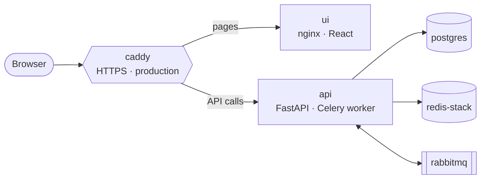

# Deplocker

**Unlock your deployments.**

Deplocker is a self-hosted platform for running containerized applications on a
server of your own. Describe an application once (where its code lives, which
branch to follow, the Dockerfile that builds it, the port it listens on, its
environment and its domain) and Deplocker is meant to carry it the rest of the
way, from a commit to a running container.

That last stretch is still being paved. What stands today is everything around
it: accounts and sign-in, organizations and their members, projects,
application settings, and a record of every deployment. The pipeline that
clones, builds and runs is the work in progress.

## How it fits together

Everything you deploy hangs from a single chain of ownership:

**organization → project → application → deployment**

- An **organization** is where people work together. Every member holds a
  role: *members* see everything in it and start deployments, *admins* also
  shape its projects and applications, and *owners* can delete them,
  deployments included.
- A **project** gathers related applications.
- An **application** is a single service: where its code lives and how it runs.
- A **deployment** is one attempt to ship an application, kept on record.

You sign in with an email and a password, with Google or GitHub, or with a
passkey.

---

## Architecture

Five services make up the stack in [docker-compose.yml](docker-compose.yml). In
production, [docker-compose.prod.yml](docker-compose.prod.yml) puts a sixth,
Caddy, in front of them:



| Service | Role | Host port |
| --- | --- | --- |
| `caddy` | The server's web server, in production only. It holds the certificates for the web app's and the API's domains and hands each request to the right container | `80`, `443` |
| `api` | The REST API ([FastAPI](https://fastapi.tiangolo.com/)), and a [Celery](https://docs.celeryq.dev/) worker for background jobs such as confirmation emails | `127.0.0.1:8080`, in development only |
| `ui` | The web app (React, Vite, Tailwind), served by nginx | `8082`, in development only |
| `postgres` | The main database | `5435` |
| `redis-stack` | Login sessions and background job results | `6380` |
| `rabbitmq` | The queue that hands background jobs to the worker | `5672`, admin UI `15672` |

The backend's inner workings are described in
[backend/CLAUDE.md](backend/CLAUDE.md), and its database, table by table, in
[backend/docs/models.md](backend/docs/models.md).

### Why Caddy

Like Dokploy with Traefik, Deplocker brings its own web server: deploying the
stack hands Caddy ports 80 and 443, and with them every request that reaches
the server. Today Caddy serves two sites, the web app and the API. It was
chosen for what the server will carry next. Every application on Deplocker has
a domain of its own, and that domain alone decides which application a request
is for. The web server in front must keep a valid certificate for every one of
those domains, and pick up a new route the moment a deployment needs it,
without a restart.

- **HTTPS takes no setup.** Caddy obtains a certificate for every domain it
  serves, renews it ahead of expiry and redirects plain HTTP to HTTPS. There is
  no certbot to install and no renewal job to schedule.
- **Its configuration is an API.** Caddy's admin API accepts a whole new
  configuration, or a change to a single route, while Caddy runs, and applies
  it without dropping a connection. That lets the Deplocker API route an
  application's domain as part of deploying it.
- **It handles domains nobody listed in advance.** With on-demand TLS, Caddy
  obtains a certificate during the first visit to a domain, after asking an
  endpoint whether that domain may have one. For Deplocker, the answer is
  whether an application claims it.
- **Its configuration stays short.** Both sites fit in a dozen lines of
  [caddy/Caddyfile](caddy/Caddyfile).

The two usual alternatives fall short on the second point:

- **Traefik** manages certificates just as well, but its API is read-only.
  Routes reach it through providers: configuration files the platform keeps
  rewriting, or labels on containers, which means handing the internet-facing
  proxy the Docker socket, root access to the host in all but name.
- **nginx** takes changes only by rewriting its files and reloading; an API
  that changes upstreams at runtime is a feature of the commercial NGINX Plus.
  Its certificates come from a separate tool or module, set up alongside it.

---

## Getting started

### 1. Install the tools

You need Docker with Compose v2, GNU Make, [uv](https://docs.astral.sh/uv/) for
Python, and Node.js with npm.

On Linux, the [dev container](.devcontainer/devcontainer.json) brings all of
them except Docker, which it borrows from the host.

### 2. Create the configuration file

Every service reads its settings from one file, `/etc/deplocker/.env`, on your
machine and on the production server alike. Compose won't start without it.
Create it from the template, then fill in the values:

```sh
sudo install -d -o "$(id -un)" -g "$(id -gn)" -m 0700 /etc/deplocker
install -m 0600 backend/.env.example /etc/deplocker/.env
$EDITOR /etc/deplocker/.env
```

### 3. Install dependencies and enable the Git hooks

```sh
make backend-install-local frontend-install-ci
git config core.hooksPath .githooks
```

The hooks are described under [Checks](#checks).

### 4. Start the stack

```sh
make start-dev
```

This builds the images if they are out of date, starts the backend containers
in the background and waits until the API reports healthy, then hands the
terminal to the Vite dev server, which reloads the page as you edit.

- Web app: <http://localhost:5173>
- API: <http://localhost:8080>, with interactive docs at
  <http://localhost:8080/docs>

<kbd>Ctrl</kbd>+<kbd>C</kbd> stops Vite, and `make stop-dev` stops the
containers.

### Everyday commands

Every command is a [Makefile](Makefile) target.

| Command | What it does |
| --- | --- |
| `make start-dev` / `make stop-dev` | Start or stop the development stack |
| `make start-dev-https` | The same, over HTTPS, for trying passkeys (see below) |
| `make start-prod` / `make stop-prod` | Run the whole stack in containers, web app included, at <http://localhost:8082> |
| `make backend-reformat` | Format the Python code and fix the lint errors Ruff can fix |
| `make frontend-reformat` | Format the frontend code |
| `make backend-test-ci` | Run the backend tests in a separate, throwaway stack; clear it away afterwards with `make backend-clean-ci` |
| `make frontend-test-ci` | Run the frontend tests |
| `make clean-dev` | Remove the containers and their images, so the next start rebuilds them |

### Trying passkeys over HTTPS

`make start-dev-https` serves the web app at <https://lvh.me:5173> and forwards
API calls through Vite at `/api`, so passkeys are created against a real domain
over HTTPS, just as in production. `lvh.me` is a public domain that points back
to `127.0.0.1`.

The certificate comes from [mkcert](https://github.com/FiloSottile/mkcert).
Install mkcert, then once per machine:

```sh
mkcert -install                  # create a local certificate authority and trust it
cd frontend && mkcert lvh.me     # write lvh.me.pem and lvh.me-key.pem
```

Restart the browser afterwards so it picks up the new authority. On Linux,
Firefox and Chrome trust it only if `certutil` (package `libnss3-tools`) was
installed before `mkcert -install`. Git ignores the `.pem` files.

---

## Checks

Every check is a Make target, and the Git hooks and CI call the very same
targets, so a check gives the same verdict on your machine as in CI.

| Hook | What it does |
| --- | --- |
| `pre-commit` | Lints the parts with staged changes through `make lint-ci`: ESLint, Prettier and the TypeScript compiler for the frontend, Ruff's format check and mypy for the backend. When models or migrations are staged, it also checks that the migrations build the schema the models describe. |
| `pre-push` | Rejects pushes to `master`, so changes reach it only through a pull request |

The hooks only report problems; they never rewrite your code. Formatting is
fixed with `make backend-reformat` or `make frontend-reformat`. Git skips the
hooks with `--no-verify`, and they stay silent in a clone that has not enabled
them.

---

## CI/CD

A single workflow, [.github/workflows/ci-cd.yml](.github/workflows/ci-cd.yml),
runs on every push to every branch. Both of its jobs run on a self-hosted
runner, which is also the production server.

**Build & Test** (`ci` job):

1. Checks each part the push changed. Frontend: lint, type check, tests.
   Backend: lint, type check, a check that the migrations match the models,
   and tests. A new branch or a force push checks both.
2. Removes the backend test stack, even after a failed check, since the next
   run reuses the runner's workspace.
3. Builds the `api` and `ui` images and publishes them to the GitHub Container
   Registry, tagged with the commit SHA and `latest`.

**Deploy to production** (`cd` job) runs on `master` only, once `ci` has
succeeded. It restarts the stack on the images `ci` just built on the same
machine, then gives the API up to three minutes to report healthy, failing the
job otherwise. Last, it reloads Caddy with the commit's Caddyfile, which Caddy
applies without a restart.

No application secret passes through the workflow: the server's configuration
lives in `/etc/deplocker/.env`, written by hand. Its `PROD_FRONTEND_URL` and
`PROD_PUBLIC_URL` are also the addresses Caddy serves, so both domains need DNS
records pointing at the server, and no other program on it may hold ports 80
and 443. GitHub needs a single repository variable:

| Variable | Purpose |
| --- | --- |
| `PROD_API_URL` | The production API URL, baked into the web app's bundle |

---

## License

[Apache License 2.0](LICENSE). Attribution requirements are in [NOTICE](NOTICE).
