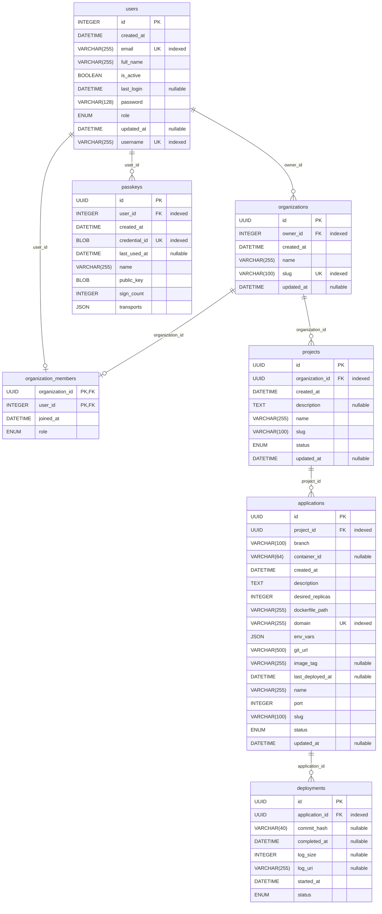

# Data model

This document describes the PostgreSQL tables behind the Deplocker API: what
each one stores and the rules that keep its data consistent. The tables are
defined as SQLAlchemy models in [app/models/](../app/models/), and Alembic
migrations in [alembic/versions/](../alembic/versions/) create them.

## Overview

Everything a user deploys belongs to an organization, through a chain of
ownership:

**organization → project → application → deployment**

- An **organization** is the unit that users share. Users join it through
  memberships, each with a role, so a user can belong to several organizations
  and an organization can have several members.
- A **project** groups related applications inside one organization.
- An **application** is one service to deploy: where its code lives and how
  to run it.
- A **deployment** records one attempt to ship an application.

Separately, each **user** can register **passkeys** to sign in without a
password.

## Diagram

The diagram is generated from the models, so it always matches them. Its line
between `users` and `organizations` through `organization_members` reads as
one-to-one, but the relationship is many-to-many, as described above.

<!-- BEGIN_SQLALCHEMY_DOCS -->

<!-- END_SQLALCHEMY_DOCS -->

## Tables

### `users`

One row per account. `username` and `email` are each unique.

- `is_active` is false until the user confirms their email address, and a
  user cannot sign in before then. Accounts created through Google or GitHub
  start active, because the provider has already verified the address.
- `password` holds a hash, never the password itself. Accounts created through
  Google or GitHub get a hash of a random value, so they have no usable
  password.
- `role` is a platform-wide role: `owner`, `admin` or `user`. It is stored in
  the login session, but no route checks it yet. Permissions inside an
  organization come from `organization_members.role` instead.

Registering an account also creates the user's default organization, named
"*username*'s organization", with the user as its owner.

### `passkeys`

The passkeys a user has registered. A passkey is a credential stored on the
user's device or security key that signs them in without a password, using
the browser's WebAuthn standard.

- `credential_id` is unique across all users, so a passkey alone identifies
  the account signing in.
- `public_key` verifies the signatures the device produces.
- `sign_count` is a counter that most devices increase on every sign-in. A
  value that fails to increase suggests the passkey was copied.
- `transports` lists how the browser can reach the device (USB, NFC,
  Bluetooth, a nearby phone, or built in), so it can prompt for the right one.

Deleting a user deletes their passkeys.

### `organizations`

- `name` is a display label and may repeat across organizations.
- `slug` is the organization's unique handle, derived from the name. A *slug*
  is the lowercase, URL-safe form of a name, such as `my-team` for "My Team".
- `owner_id` is the user who created the organization.

### `organization_members`

Links users to organizations: one row per membership, holding the member's
`role`. Each role includes everything the roles below it can do:

| Role | Can |
| --- | --- |
| `member` | View everything in the organization and start deployments |
| `admin` | Also create and edit projects and applications |
| `owner` | Also delete projects, applications and deployments |

### `projects`

A project belongs to one organization. Its `name` and `slug` are unique within
that organization, so different organizations can use the same project names.

`status` is one of `created`, `active` (the default), `archived` or
`suspended`.

Deleting a project deletes its applications, and with them their deployments.
Deleting an organization deletes its projects in the same way.

### `applications`

An application belongs to one project. Its `name` and `slug` are unique within
that project. `domain` is unique across all applications, because the domain
alone identifies which application a request is for.

Its configuration says where the code lives and how to run it:

| Column | Meaning | Default |
| --- | --- | --- |
| `git_url` | Repository to deploy | |
| `branch` | Branch to deploy | `main` |
| `dockerfile_path` | Dockerfile that builds the image, relative to the repository root | `./Dockerfile` |
| `port` | Port the application listens on inside its container | `8000` |
| `env_vars` | Environment variables passed to the container | none |
| `desired_replicas` | Number of containers to run | `1` |

`status` is one of `created` (the default), `deploying`, `running`,
`unhealthy` (running, but failing health checks), `stopped`, `failed` or
`deleting`.

`container_id`, `image_tag` and `last_deployed_at` describe the running
container. They stay empty until the deployment pipeline is implemented.

Deleting an application deletes its deployments.

### `deployments`

One row per attempt to deploy an application.

- `status` follows the steps of a deployment: `pending` → `cloning` →
  `building` → `pushing` → `deploying` → `health_checking`, ending in
  `success`, `failed` or `cancelled`. New deployments start as `pending`;
  nothing moves them further until the deployment pipeline is implemented.
- `started_at` and `completed_at` mark when the attempt began and ended.
- `commit_hash` is the Git commit being deployed.
- `log_uri` points to the deployment's log file, on local disk or in cloud
  storage, and `log_size` is that file's size in bytes. The log itself is not
  stored in the database.

An index on `application_id` and `started_at` keeps listing an application's
most recent deployments fast.

## Updating the diagram

The diagram is generated with [paracelsus](https://github.com/tedivm/paracelsus).
After changing a model, regenerate it from the `backend` directory:

```bash
uv run paracelsus inject docs/models.md app.core.database:Base --import-module "app.models:*"
```

The command replaces only the text between the `BEGIN_SQLALCHEMY_DOCS` and
`END_SQLALCHEMY_DOCS` markers, so the rest of this document is kept.
