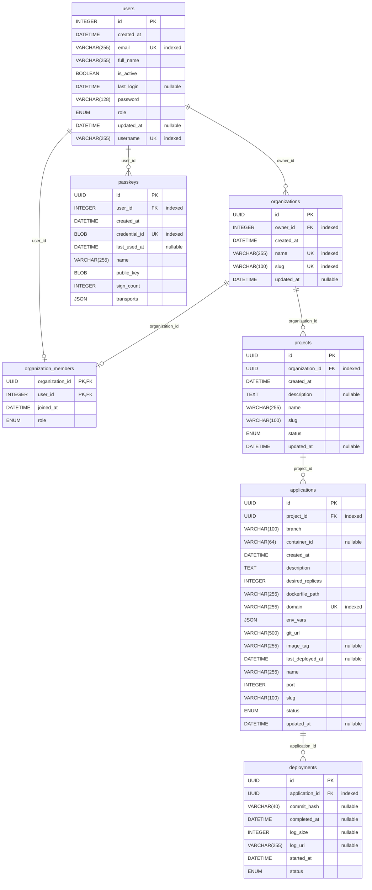

# Data Model

Generated from the SQLAlchemy models with [paracelsus](https://github.com/tedivm/paracelsus). Regenerate with:

```bash
uv run paracelsus inject docs/models.md app.core.database:Base --import-module "app.models:*"
```

<!-- BEGIN_SQLALCHEMY_DOCS -->

<!-- END_SQLALCHEMY_DOCS -->
